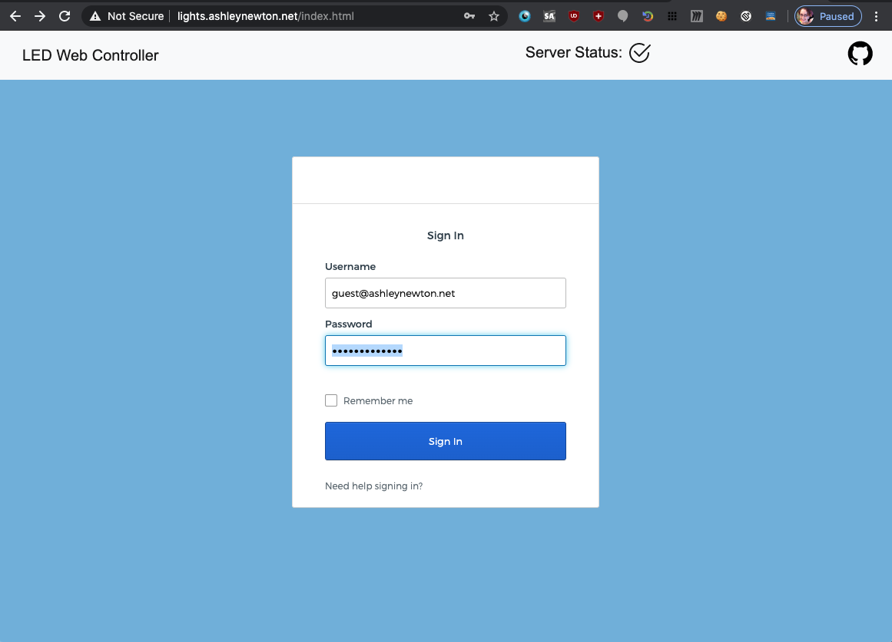
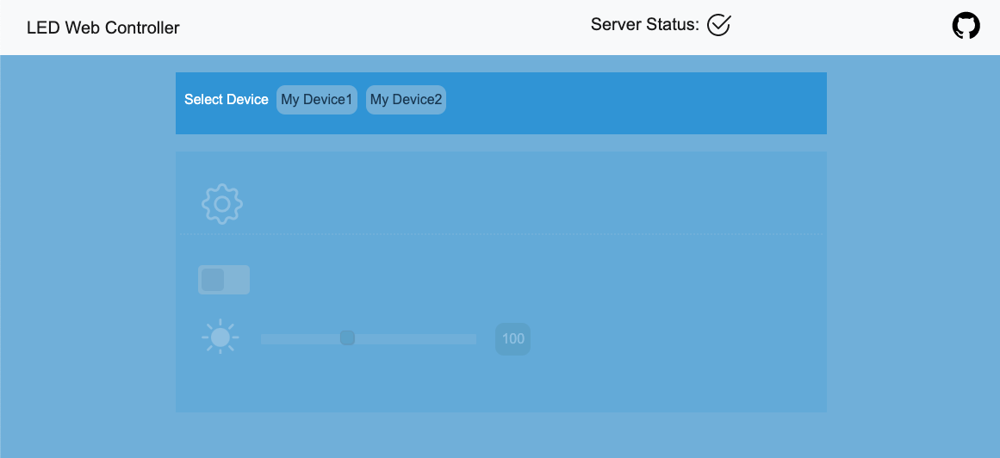
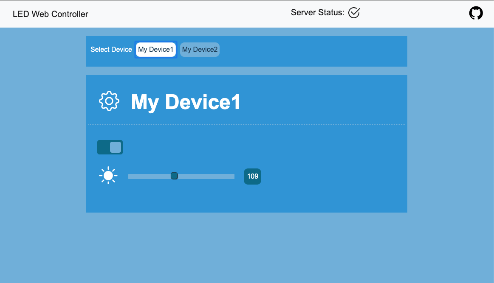
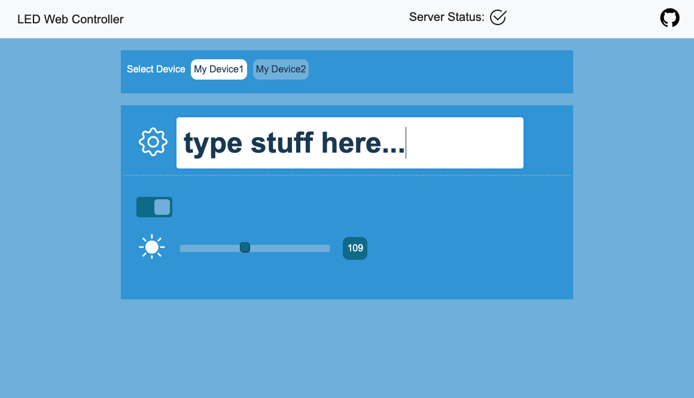
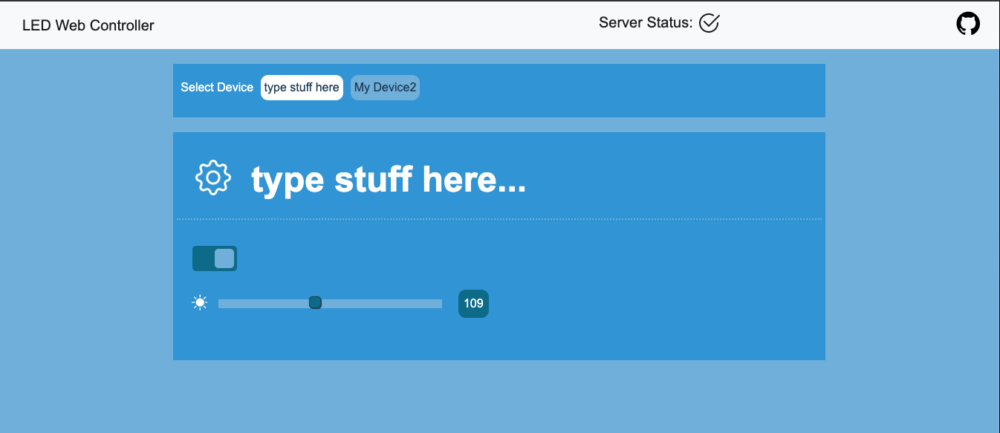
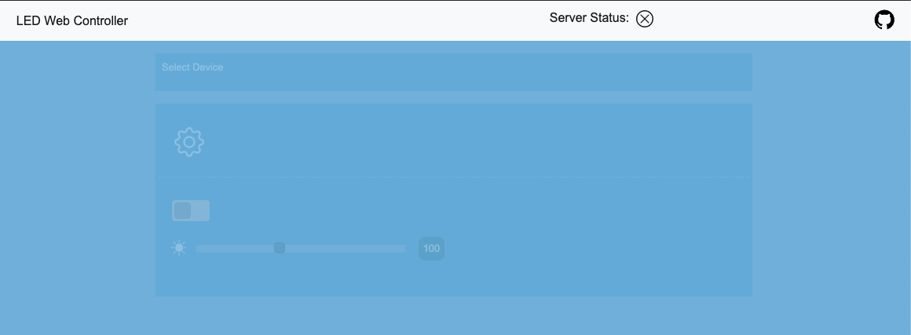

# LED-IOT-API
<!-- PROJECT SHIELDS -->
[](https://circleci.com/gh/technorainbows/LED-IOT-api)
[![LinkedIn][linkedin-shield]][linkedin-url]
<!-- [![MIT License][license-shield]][license-url] -->
A demo [web app](http://lights.ashleynewton.net) for controlling networked LED devices.

<!-- TABLE OF CONTENTS -->
<!-- ## Table of Contents
* [About the Project](#about-the-project)
  * [Built With](#built-with) -->
<!-- * [Getting Started](#getting-started) -->
  <!-- * [Prerequisites](#prerequisites) -->
  <!-- * [Installation](#installation) -->
<!-- * [Usage](#usage) -->
<!-- * [Screenshots](#screenshots)
* [Roadmap](#roadmap)
* [License](#license)
* [Contact](#contact)
* [Acknowledgements](#acknowledgements) -->


<!-- ABOUT THE PROJECT -->
<!-- ## About The Project
The goal of this project has been two fold:  1) to teach myself  -->

### Technologies

* **REST API**: Python 3, [flask restplus](https://flask-restplus.readthedocs.io/en/stable/), redis-py, pyjwt, [Okta](http://www.okta.com), Swagger
* **Webpage**: Javascript + jQuery, Bootstrap 4, HTML5, CSS
* **Arduino**: C, ESP32, [FastLED](http://fastled.io)
* **CI/CD**: Docker, CircleCI, AWS, [Pytest](https://docs.pytest.org/en/latest/) + [Pytest-Flask](https://pypi.org/project/pytest-flask/)


<!-- GETTING STARTED -->
<!-- ## Getting Started -->

<!-- To get a local copy up and running follow these simple steps. -->

<!-- ### Prerequisites -->

<!-- This is an example of how to list things you need to use the software and how to install them.
* npm
```sh
npm install npm@latest -g
``` -->

<!-- ### Installation -->
 
<!-- 1. Clone the LED-IOT-api
```sh
git clone https://github.com/technorainbows/LED-IOT-api.git
``` -->

<!-- ### Local Installation
1. Clone repository
2.  -->


### Usage
<!-- 1. Users must first provide authentication credentials before accessing the app.


2. Once a user is logged in, they are taken to the main page view. User is prompted to select an available online device.
 -->

<!-- 3. Once a device is selected, the user is able to turn the device's lights on and off, change the light's brightness, and rename the device. -->


<!-- 4. To rename a device, a user simply clicks the device name and is able to type in the new name. Upon hitting enter, the name is saved and updated in the device list.
 
The device has now been renamed.

5. If the server where the API is hosted is down, the status will be displayed to the user. Until the server is up, the user will be unable to select or edit any device settings. 
 -->


<!-- USAGE EXAMPLES -->
<!-- ## Usage -->

<!-- Use this space to show useful examples of how a project can be used. Additional screenshots, code examples and demos work well in this space. You may also link to more resources.

_For more examples, please refer to the [Documentation](https://example.com)_
 -->


<!-- ROADMAP -->
### Roadmap
See the [open issues](https://github.com/technorainbows/LED-IOT-api/issues) for a list of proposed features and known issues.


<!-- CONTRIBUTING -->
<!-- ## Contributing

Contributions are what make the open source community such an amazing place to be learn, inspire, and create. Any contributions you make are **greatly appreciated**.

1. Fork the Project
2. Create your Feature Branch (`git checkout -b feature/AmazingFeature`)
3. Commit your Changes (`git commit -m 'Add some AmazingFeature'`)
4. Push to the Branch (`git push origin feature/AmazingFeature`)
5. Open a Pull Request -->


<!-- LICENSE -->
### License

<!-- See `LICENSE` for more information. -->
<a rel="license" href="http://creativecommons.org/licenses/by-nc-sa/4.0/"></a><br />This work by <a xmlns:cc="http://creativecommons.org/ns#" href="https://github.com/technorainbows/LED-IOT-api" property="cc:attributionName" rel="cc:attributionURL">Ashley Newton</a> is licensed under a <a rel="license" href="http://creativecommons.org/licenses/by-nc-sa/4.0/">Creative Commons Attribution-NonCommercial-ShareAlike 4.0 International License</a>.


<!-- CONTACT -->
<!-- ## Contact

[Ashley Newton](http://www.ashleynewton.net) - [@technorainbows](https://github.com/technorainbows/) - [i@ashleynewton.net](mailto:i@ashleynewton.net) -->


<!-- ACKNOWLEDGEMENTS -->
### Acknowledgements
Thanks to [@jmorris0x0](https://github.com/jmorris0x0/) for primary mentorship and [@cagerton](https://github.com/cagerton/) for support mentorship.
<!-- *  -->


<!-- MARKDOWN LINKS & IMAGES -->
<!-- https://www.markdownguide.org/basic-syntax/#reference-style-links -->

<!-- [contributors-shield]: https://img.shields.io/github/contributors/othneildrew/Best-README-Template.svg?style=flat-square
[contributors-url]: https://github.com/othneildrew/Best-README-Template/graphs/contributors
[forks-shield]: https://img.shields.io/github/forks/othneildrew/Best-README-Template.svg?style=flat-square
[forks-url]: https://github.com/othneildrew/Best-README-Template/network/members
[stars-shield]: https://img.shields.io/github/stars/othneildrew/Best-README-Template.svg?style=flat-square
[stars-url]: https://github.com/othneildrew/Best-README-Template/stargazers
[issues-shield]: https://img.shields.io/github/issues/othneildrew/Best-README-Template.svg?style=flat-square
[issues-url]: https://github.com/othneildrew/Best-README-Template/issues -->
<!-- [license-shield]: https://img.shields.io/github/license/othneildrew/Best-README-Template.svg?style=flat-square -->
<!-- [license-url]: https://github.com/othneildrew/Best-README-Template/blob/master/LICENSE.txt -->
[linkedin-shield]: https://img.shields.io/badge/-LinkedIn-black.svg?style=flat-square&logo=linkedin&colorB=555
[linkedin-url]: https://linkedin.com/in/ashleymnewton
<!-- [product-screenshot]: images/screenshot.png -->